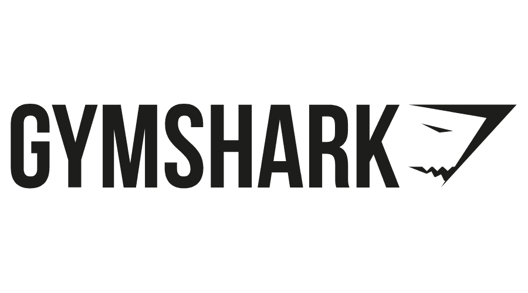

<!-- PROJECT LOGO -->
<br />
<div align="center">
  <a href="https://github.com/KeevenSivanathan/gymshark_StoreReport">
    
  </a>

  <h3 align="center">Gymshark Store Report</h3>

  <p align="center">
    Generates a PDF report on data collected from web scraper.
    <br />
    <a href="https://github.com/KeevenSivanathan/gymshark_StoreReport"><strong>Explore the docs »</strong></a>
    <br />
    <br />
    <a href="https://github.com/KeevenSivanathan/gymshark_StoreReport/blob/main/gymshark_scraper.py">Web Scraper</a>
    ·
    <a href="https://github.com/KeevenSivanathan/gymshark_StoreReport/blob/main/clean.py">Data Cleaning</a>
    ·
    <a href="https://github.com/KeevenSivanathan/gymshark_StoreReport/blob/main/create_report.py">Report Creation</a>
  </p>
</div>

<!-- TABLE OF CONTENTS -->
<details>
  <summary>Table of Contents</summary>
  <ol>
    <li>
      <a href="#about-the-project">About The Project</a>
      <ul>
        <li><a href="#built-with">Built With</a></li>
      </ul>
    </li>
    <li>
      <a href="#getting-started">Getting Started</a>
      <ul>
        <li><a href="#prerequisites">Prerequisites</a></li>
      </ul>
    </li>
    <li><a href="#usage">Usage</a></li>
    <li><a href="#process">Process</a></li>
    <li><a href="#results">Results</a></li>
    <li><a href="#contact">Contact</a></li>
    <li><a href="#acknowledgments">Acknowledgments</a></li>
  </ol>
</details>

<!-- ABOUT THE PROJECT -->

## About The Project

In the era of big data, obtaining useful information has become crucial for many businesses and individuals alike. One way to extract valuable data from websites is through web scraping, which is the automated process of collecting data from web pages.

In this project, we will explore the process of web scraping by focusing on a store's website. By scraping the website, we can extract information about products, prices, and colors, among other data points. This data can be used for a variety of purposes, such as monitoring competitors' prices, identifying trends in customer behavior, and improving inventory management. Moreover, we will generate a PDF report on the stores products using various data visualization methods.

This project will focus on [Gymshark](https://us.shop.gymshark.com/pages/about-us), a fitness apparel brand that was founded in 2012 and received a £1 billion valuation in 2020.

<p align="right">(<a href="#readme-top">back to top</a>)</p>

### Built With

This section should list any major frameworks/libraries used to bootstrap your project. Leave any add-ons/plugins for the acknowledgements section. Here are a few examples.

- [![Python][python]][python-url]
- [![Pandas][pandas]][pandas-url]
- [Beautiful Soup](https://beautiful-soup-4.readthedocs.io/en/latest/)
- [Seaborn Visualization](https://seaborn.pydata.org/)
- [FPDF](http://www.fpdf.org/)

<p align="right">(<a href="#readme-top">back to top</a>)</p>

### Prerequisites

Must have Python installed. I am using version 3.9.

Libraries that need to be installed:

- Pandas

  ```sh
  pip install pandas
  ```

- Beautiful Soup

  ```sh
  pip install beautifulsoup4
  ```

- Seaborn

  ```sh
  pip install seaborn
  ```

- FPDF
  ```sh
  pip install fpdf
  ```

<!-- USAGE EXAMPLES -->

## Usage

- Gymshark Scraper

  ```
  python3 gymshark_scraper.py webpage file_name.csv
  ```

- Data Cleaning

  ```
  python3 clean.py file_name.csv
  ```

- Report Generator

  ```
  python3 create_report.py file_name
  ```

  Example:

    

<p align="right">(<a href="#readme-top">back to top</a>)</p>

<!-- PROCESS -->

## Process

1. Using Beautiful Soup to build a web scraper that is able to parse through data on the Gymshark website to get data such as the product name, price, color, and discount if there is one. This data is then stored as a csv file. Using the web scraper to get data on three different webpages of the Gymshark website: Mens, Womens and Accessories.

2. The three separate csv files are combined and cleaned in order to fill in missing values. New features such as Discount Percentage and Type of Product were also made.

3. Using seaborn and matplotlib to create data visualizations to show the breakdown of the online store. Then using FPDF to generate a report using those visualizations.

<p align="right">(<a href="#readme-top">back to top</a>)</p>

## Results

<div align="center">
    
</div>

<p align="right">(<a href="#readme-top">back to top</a>)</p>

<!-- CONTACT -->

## Contact

[LinkedIn](https://www.linkedin.com/in/ksivanathan/)

OR

Email me --> keeveneven@gmail.com

<p align="right">(<a href="#readme-top">back to top</a>)</p>

<!-- ACKNOWLEDGMENTS -->

## Acknowledgments

Resources I used in order to build this project.

- [Beautiful Soup Guide by GeeksforGeeks](https://www.geeksforgeeks.org/implementing-web-scraping-python-beautiful-soup/)
- [Donut Plot](https://www.python-graph-gallery.com/donut-plot/)
- [Using FPDF](https://towardsdatascience.com/how-to-create-a-pdf-report-for-your-data-analysis-in-python-2bea81133b#c1f8)
- [Img Shields](https://shields.io)
- [DaFont](https://www.dafont.com/bebas-neue.font)
- [Gymshark](https://gymshark.com)

<p align="right">(<a href="#readme-top">back to top</a>)</p>

<!-- MARKDOWN LINKS & IMAGES -->
<!-- https://www.markdownguide.org/basic-syntax/#reference-style-links -->

[python]: https://img.shields.io/badge/python-3670A0?style=for-the-badge&logo=python&logoColor=ffdd54
[python-url]: https://www.python.org/
[pandas]: https://img.shields.io/badge/pandas-%23150458.svg?style=for-the-badge&logo=pandas&logoColor=white
[pandas-url]: https://pandas.pydata.org/
